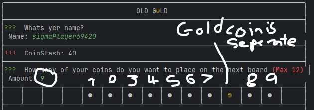
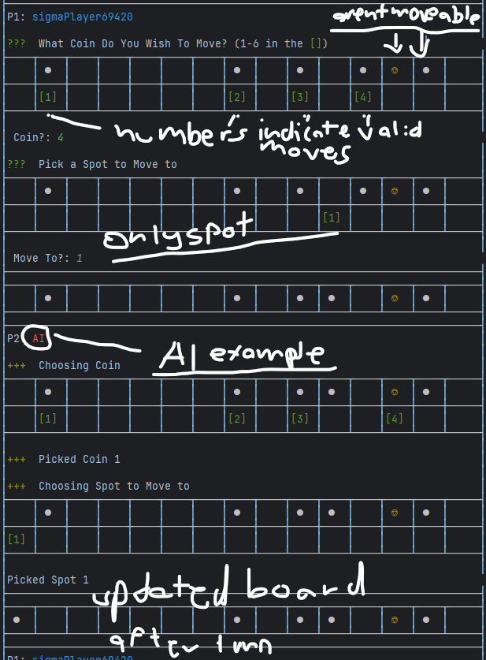
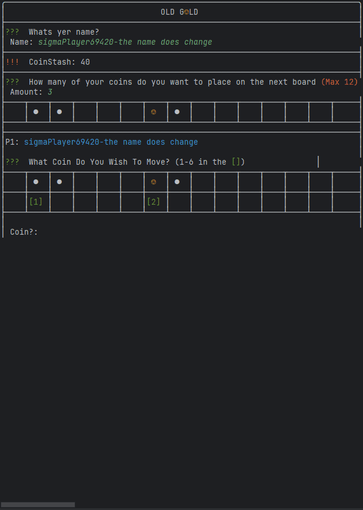
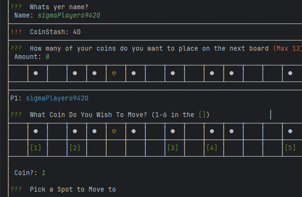
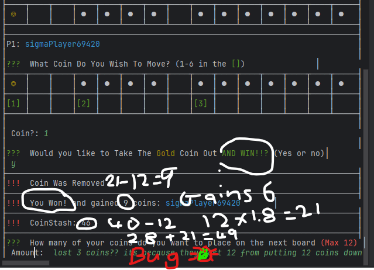
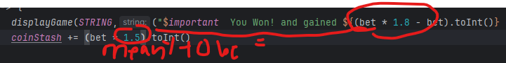

# Results of Testing

The test results show the actual outcome of the testing, following the [Test Plan](test-plan.md)

---

## The game sets up

when the code is run the game sets everything up so the player can play and no coin can start in the first slot

### Test Data Used

the output after the setup shows a table with set amount of coins from coinstash (excluding gold coin) and clearly showing where coins are

### Test Result

the player selected 9 coins to put on the board from their stash, the board was set up with 9 coins on the board (doesn't include gold coin)

---

## Player Moves

the player has proper control over what they want to do and that they cant do stuff they're not meant to

### Test Data Used

output display that SHOWS players option and where they can move to plus what coins they can pick to move and the coins must be moveable same goes for the ai

### Test Result

player options display valid moves, the player and ai can both select coins and move them to valid spots

---

## Player takes turn with ai

players swap between turns between ai and player

### Test Data Used

a gif of the player doing their turn then the ai doing its turn

### Test Result

the player swaps turns with ai multiple times

---

## Player gains coins back into their coin stash and loses them and highscore is correct also shows winning and losing

coin stash changes with every win/loss and highscore also changes 

### Test Data Used

messing with winning and losing to make sure its happening at the right time and score gains right

### Test Result

the coinstash in 40 and its the highscore when they lose which was the highest it went so that works. when they ran out of coins from losing 46 the game ended and they got their highscore

this shows winning works and i found a mistake in the code fix below ss. the score now also updates properly

i had changed the multiplier to 1.8x but i left it at 1.5x in the actual important part of the code

it is now fixed
---

